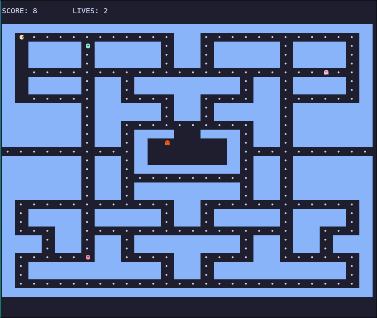

# pacman

pacman tui app made with [bubbletea](https://github.com/charmbracelet/bubbletea) and other [charm.sh](https://charm.sh) libraries

made for trying out charm.sh libraries and elm-like architectures

## Run

You can either build and run the binary for the game:

```bash
make run-tui
```

Or, build and run the ssh server for the game and ssh into it:

```bash
# Using the script
PORT=8080 make run-ssh

# Or with docker
docker run --rm -it -p 8080:8080 -e PORT=8080 ghcr.io/ary82/pacman:main

# ssh into the game
ssh ssh://0.0.0.0:8080
```

<p align="center">
    
</p>
